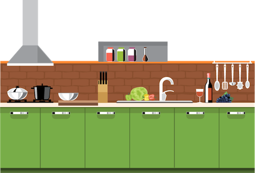

---
# Feel free to add content and custom Front Matter to this file.
# To modify the layout, see https://jekyllrb.com/docs/themes/#overriding-theme-defaults

layout: default
title: Vincent Van Doughnut
---

    <h1>I'm Vincent Van Doughnut.</h1>
    <h2>a food artist.</h2>
    

      
      
    

    
  

  

    

      
      <h2>Hello.</h2>
      
I'm a food artist from Arles, France. I love using food as my medium and a plate as my canvas.

    

    

    

      <h2>My Skills.</h2>
      

        
        

          <h3>I can create whatever you can imagine.</h3>
          
I make original pieces of art, as well as recreations of other people's work. I use all different types of food to achieve the best look.

        

      

      

        
        

          <h3>I can also paint with oil.</h3>
          
On the side, I enjoy painting with oil-based paint. I'm largely self-taught and I would say my style is Post-Impressionism.

        

      

    

    

    

      <h2>Get In Touch</h2>
      <h3>I'm currently available freelance work.</h3>
      
If you have a food art request, want to do a class, or just want to introduce yourself, please message me.

      <a class="butn" href="mailto:name@email.com">CONTACT ME</a>
    

  

